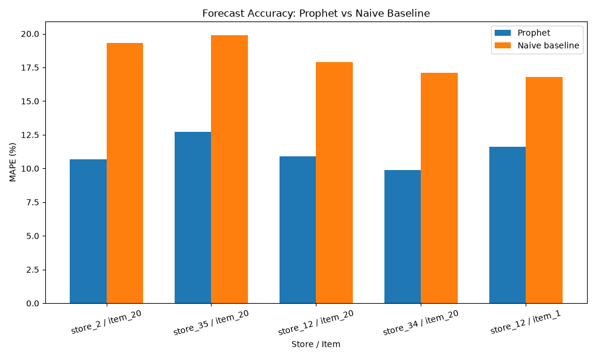
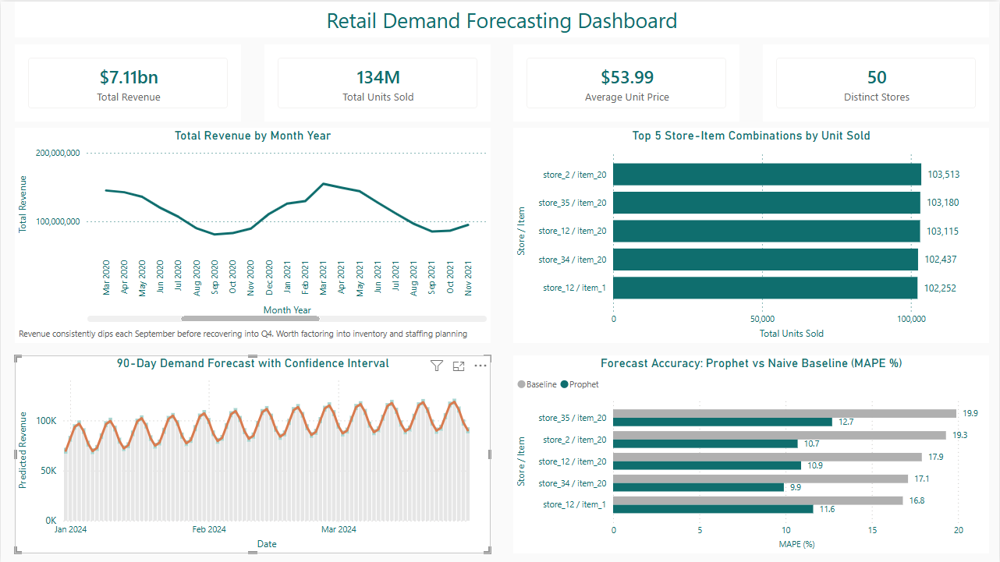

---

# Retail Demand Forecasting on Azure
## Predicting 90-Day Demand and Quantifying Forecast Accuracy for Retail Operations

---

## Project Overview
Retailers lose money in two directions at once, overstocking ties up capital and increases holding cost, while understocking loses sales and damages customer trust. Most retail planning still relies on repeating last year's numbers rather than a forecast that has actually been tested against a benchmark. This project builds a full demand forecasting pipeline on Azure, from raw transaction data through to a validated 90-day forecast and a decision-oriented Power BI dashboard, and quantifies exactly how much better that forecast is than the naive alternative before asking anyone to trust it. Using 4.5 million daily transaction records across 50 stores and multiple Stock Keeping Units (SKUs) from 2019 to 2023, the analysis identifies a recurring seasonal revenue risk, isolates the highest-risk SKU-store combinations, and delivers a forecasting model benchmarked at roughly a 50% reduction in error against a naive baseline. This project demonstrates a scalable demand forecasting methodology applicable across retail, consumer goods and any inventory-based business operating at scale.

---

## Objectives
- Provision and configure a cloud data pipeline on Azure, from raw storage through to a query-ready warehouse.
- Stage and model 4.5 million retail transaction records into analysis-ready tables.
- Identify the highest volume SKU-store combinations carrying the greatest inventory risk.
- Build and backtest a Prophet forecasting model against a naive seasonal baseline on a 90-day holdout.
- Quantify forecast accuracy improvement using MAPE, rather than presenting a forecast without a benchmark.
- Produce a 90-day forward forecast with a confidence interval to represent uncertainty honestly.
- Load model outputs and backtest results back into Azure SQL Database for BI consumption.
- Present key findings in a single, decision-oriented Power BI dashboard.

---

## Data Source
| | |
|---|---|
| **Dataset** | Store Item Demand Forecasting Dataset (Kaggle) |
| **Records** | 4,565,000 transaction rows |
| **Coverage** | 50 stores, multiple SKUs, daily granularity, 2019 to 2023 |
| **Target Variable** | Daily units sold and revenue, forecasted at SKU-store level |
| **Licence** | Public dataset, used for portfolio and educational purposes |

---

## Tools and Libraries
| Tool | Purpose |
|---|---|
| Azure Blob Storage | Raw data landing zone |
| Azure Data Factory | Orchestrated ingestion from Blob into Azure SQL Database |
| Azure SQL Database | Staged, modeled and forecast output storage |
| Python 3.12 | Core programming language |
| pandas | Data loading, cleaning and transformation |
| Prophet | Time series forecasting model |
| scikit-learn | Backtest evaluation metrics |
| pymssql / pyodbc | Python to Azure SQL Database connection |
| SQLAlchemy | Database read and write operations |
| dbt | Transformation logic, version controlled and documented |
| GitHub Actions | CI/CD automation: linting and dbt tests on every push, dbt run on merge to main |
| Power BI Desktop | Interactive dashboard |

---

## Key Findings

### Dataset Overview
The dataset contained 4.5 million daily transaction records across 50 stores and multiple SKUs, spanning January 2019 to December 2023, with no gaps in the date range identified during staging. This volume shaped several downstream decisions, including which tables were loaded into the BI layer and how the transformation logic was ultimately executed.

### Seasonal Revenue Pattern
Monthly revenue shows a consistent, recurring dip every September, holding in 4 of the last 5 years in the dataset. This is a strong enough pattern to treat as structural rather than noise, and supports shifting promotional spend forward into August and trimming September staffing schedules ahead of the historical trough, rather than reacting to it after the quarter closes.

### Top Sellers and Inventory Risk
Five SKU-store combinations account for the highest unit volumes in the dataset, all connected to a single high-demand item, item_20, sold across four different stores, alongside one additional high-volume item at a fifth store. These combinations were identified independently through both a standalone Python analysis and the Power BI dashboard, producing matching results, and represent the SKUs carrying the greatest stockout risk and therefore the tightest case for elevated safety stock and reorder review frequency.

### dbt Cloud Constraint and Engineering Judgment
dbt Cloud's Synapse connector produced a persistent, intermittent connection failure against Azure SQL Database at this data volume. Rather than force that path, the transformation logic was kept fully version controlled as dbt models in the repository, and the project moved to running dbt directly via the CLI instead of dbt Cloud, which resolved the connection issue entirely. Local CLI validation confirmed dbt could connect and execute reliably against Azure SQL Database, and this was subsequently automated via GitHub Actions (see Continuous Integration & Deployment below).

### Forecasting Model Development
Prophet was backtested against a naive seasonal baseline (last year's values repeated) on a 90-day holdout, across the five highest-volume SKU-store combinations. Prophet outperformed the naive baseline on every item tested, roughly halving MAPE in most cases, for example a reduction from 19.3% to 10.7% MAPE on the highest-volume combination. This validation step was treated as a gate, the forward forecast was only produced once the model had demonstrated a measurable, quantified improvement over doing nothing.

### Forecast Accuracy and Business Trust
The forward-looking 90-day forecast is presented with a shaded confidence interval rather than a single point estimate, reflecting the model's actual uncertainty rather than a misleadingly precise number. Combined with the benchmarked accuracy improvement, this gives planning teams a defensible basis for ordering and staffing decisions over the forecast window, rather than a forecast taken on faith.

### Dashboard Design and Scale Constraints
At 4.5 million rows, loading both the staging table and the mart table into the same Import-mode Power BI model produced repeated transport-level connection failures during refresh, since the staging table added volume without adding information the mart table didn't already carry in aggregated form. Only the mart table was loaded into the dashboard as a result, a scale-aware design decision rather than an oversight.

---

## Dashboard Pages
| Section | Description |
|---|---|
| 1 | KPI summary: total revenue, total units sold, average unit price, distinct stores |
| 2 | Monthly revenue trend, 2019 to 2023, with September seasonal dip callout |
| 3 | Top 5 SKU-store combinations by unit volume |
| 4 | 90-day demand forecast with confidence interval |
| 5 | Forecast accuracy: Prophet vs naive baseline MAPE by SKU-store combination |

---

## Data Objects
| Object | Description |
|---|---|
| 1 | `stg_retail_sales` — staged raw transaction data (view) |
| 2 | `fct_daily_sales` — daily aggregated sales fact table (view) |
| 3 | `forecast_results` — Prophet forecast output, historical fit and 90-day forward forecast (1,916 rows) |
| 4 | `backtest_results` — Prophet vs naive baseline backtest comparison by SKU-store combination (5 rows) |

---

## How to Run

### 1. Clone the Repository
```bash
git clone https://github.com/Kingsley-Eboh/retail-demand-forecasting-azure.git
cd retail-demand-forecasting-azure
```

### 2. Provision Azure Resources
Create a resource group containing Blob Storage, Data Factory and Azure SQL Database. Upload the Kaggle dataset to Blob Storage and run the Data Factory pipeline to copy it into Azure SQL Database.

### 3. Build the Staging and Mart Tables
Run the SQL in `models/staging` and `models/marts` against the database to build `stg_retail_sales` and `fct_daily_sales`.

### 4. Install Dependencies
```bash
pip install pandas prophet pymssql sqlalchemy pyodbc scikit-learn --break-system-packages
```

### 5. Run the Forecasting Scripts
Run the scripts in `forecasting/` in order:
```bash
python forecast.py
python top_sellers.py
python backtest_forecast.py
python plot_backtest.py
python prophet_forecast.py
python write_forecast_to_sql.py
```
Set `DB_PASSWORD` as an environment variable before running, credentials are never hardcoded.

### 6. Open the Power BI Dashboard
Open `dashboard/retail-demand-forecasting-dashboard.pbix` in Power BI Desktop and point it at your own Azure SQL Database connection details.

---

## Continuous Integration & Deployment
This project uses GitHub Actions to automatically validate and deploy changes to the dbt models:

- **CI** (`.github/workflows/ci.yml`) runs on every push and pull request: lints the Python scripts and runs 10 dbt data quality tests (not-null checks across key columns in `stg_retail_sales` and `fct_daily_sales`) against the live Azure SQL Database.
- **CD** (`.github/workflows/deploy.yml`) runs on every push to `main`: rebuilds the dbt models (`dbt run`) and re-validates them (`dbt test`), so `main` always reflects a tested, working state of the pipeline.

---

## Project Structure

```
retail-demand-forecasting-azure/
├── .github/
│   └── workflows/
│       ├── ci.yml
│       └── deploy.yml
├── models/
│   ├── staging/stg_retail_sales.sql
│   ├── marts/fct_daily_sales.sql
│   └── schema.yml
├── dbt_project.yml
├── forecasting/
│   ├── forecast.py
│   ├── top_sellers.py
│   ├── backtest_forecast.py
│   ├── plot_backtest.py
│   ├── prophet_forecast.py
│   └── write_forecast_to_sql.py
├── dashboard/
│   ├── retail-demand-forecasting-dashboard.pbix
│   └── dashboard_overview.png
├── figures/
│   └── backtest_comparison.png
├── data/
├── .gitignore
└── README.md
```

---

## Evidence

### Backtest: Prophet vs Naive Baseline
[](figures/backtest_comparison.png)

### Power BI Dashboard: Overview
[](dashboard/dashboard_overview.png)

---

## Author
**Kingsley Eboh**
[GitHub](https://github.com/Kingsley-Eboh)

*Data used for portfolio and educational purposes.*
